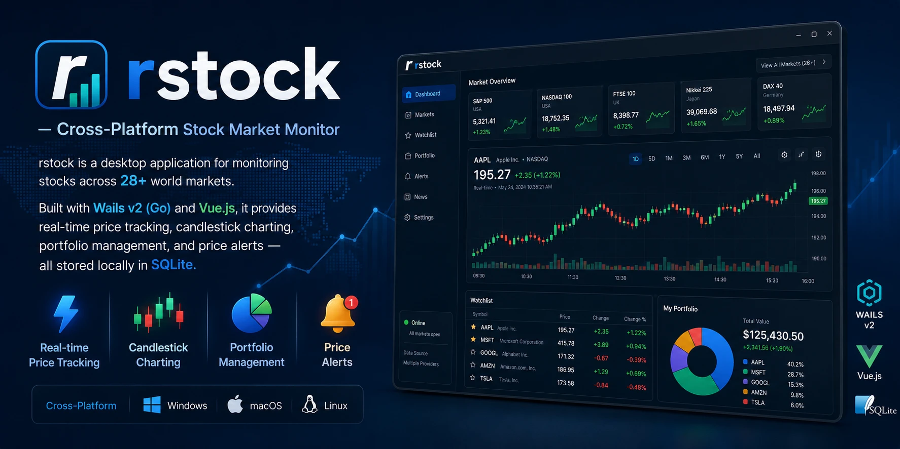

# rstock — Cross-Platform Stock Market Monitor

rstock is a desktop application for monitoring stocks across 28+ world markets. Built with Wails v2 (Go) and Vue.js, it provides real-time price tracking, candlestick charting, portfolio management, and price alerts — all stored locally in SQLite.

Inspired by [JStock](https://github.com/yccheok/jstock).


<div align="center">

</div>

## Features

### Phase 1 — Watchlist & Charting (Complete)
- **28+ world stock markets** — NYSE, NASDAQ, JKSE, HKEX, TSE, LSE, ASX, and more
- **Real-time price polling** — Auto-refresh with configurable interval
- **Candlestick charts** — TradingView Lightweight Charts with 1D to MAX timeframes
- **Symbol search** — Yahoo Finance search with country filter
- **Dark theme** — WAAG AAA compliant (14.3:1 contrast ratio)
- **Local SQLite storage** — All data persisted locally, WAL mode

### Phase 2 — Portfolio Management (Complete)
- **Multi-portfolio** — Create named portfolios (IDX Trading, US Long Term, etc.)
- **Buy/Sell transactions** — Record trades with quantity, price, fees, and date
- **Realized & unrealized gain/loss** — Track performance per position and overall
- **Holdings view** — Current positions with cost basis and market value
- **Transaction history** — Full log with date, type, symbol, and totals

### Phase 3 — Price Alerts (Complete)
- **Price triggers** — Above/below threshold alerts per stock
- **Desktop notification** — In-app alert panel
- **Sound alert** — Web Audio API beep on trigger

### Planned Phases
| Phase | Feature | Status |
|-------|---------|--------|
| 4A | Technical Indicator Editor (SMA, EMA, RSI, MACD) | Planned |
| 4B | Indicator Scanner | Planned |
| 4C | Stock Market News | Planned |
| 4D | Cloud Sync (backup/restore) | Planned |
| 5 | Currency Exchange | Planned |
| 6 | Export/Import (CSV/JSON) | Planned |
| 7 | i18n Localization | Planned |
| 8 | Stock Comparison | Planned |

## Tech Stack

| Layer | Technology |
|-------|-----------|
| Desktop Framework | Wails v2.10.2 |
| Backend | Go 1.23+ |
| Frontend | Vue 3 (Composition API), Vite |
| State Management | Pinia 2 |
| Routing | Vue Router 4 (hash mode) |
| Charts | TradingView Lightweight Charts 4 |
| Database | SQLite 3 (via mattn/go-sqlite3) |
| Data Source | Yahoo Finance v8 API |
| Font | JetBrains Mono |

## Prerequisites

- **Go** 1.22+ ([download](https://go.dev/dl/))
- **Node.js** 18+ ([download](https://nodejs.org/))
- **Wails CLI** v2.10+ ([install guide](https://wails.io/docs/gettingstarted/installation))
- **CGO enabled** (required for SQLite)
- **Linux:** `libgtk-3-dev`, `libwebkit2gtk-4.1-dev` ([details](https://wails.io/docs/gettingstarted/installation#linux))
- **macOS:** Xcode Command Line Tools
- **Windows:** WebView2 runtime

### Install Wails CLI

```bash
go install github.com/wailsapp/wails/v2/cmd/wails@latest
```

Verify installation:

```bash
wails doctor
```

## Clone & Setup

```bash
# Clone the repository
git clone https://github.com/yourusername/rstock.git
cd rstock

# Install frontend dependencies
cd frontend && npm install && cd ..

# Run development mode
wails dev
```

The application window will open automatically. The dev server also exposes:
- **Frontend:** `http://localhost:5173` (Vite HMR)
- **Browser debug:** `http://localhost:34115` (call Go methods from devtools)

## Build

### Development build (fast, no compression)

```bash
wails dev
```

### Production build (single binary)

```bash
wails build
```

The output binary is at `build/bin/rstock`.

### Cross-compilation

```bash
# Linux
wails build -platform linux/amd64

# Windows
wails build -platform windows/amd64

# macOS Intel
wails build -platform darwin/amd64

# macOS Apple Silicon
wails build -platform darwin/arm64
```

### Frontend only

```bash
cd frontend && npm run build
```

## Project Structure

```
rstock/
├── main.go                     # Wails v2 entry point
├── app.go                      # App struct — 25 bound methods, startup/shutdown
├── models/models.go            # 12 shared Go structs
├── services/
│   ├── database.go             # SQLite init, migrate, 30+ CRUD methods
│   ├── yahoo.go                # Yahoo Finance v8 API client
│   ├── market.go               # Exchange config, 28 exchange seeds
│   ├── watchlist.go            # Symbol CRUD, polling goroutine
│   ├── chart.go                # Chart data (DB-first, Yahoo fallback)
│   ├── settings.go             # App settings (polling, theme, window)
│   ├── portfolio.go            # Portfolio CRUD, holdings computation
│   └── alert.go                # Alert CRUD, background check loop
├── frontend/
│   ├── index.html
│   ├── package.json
│   ├── vite.config.js
│   ├── wailsjs/                # Auto-generated Wails bindings
│   └── src/
│       ├── main.js             # Vue entry, Router (hash), Pinia
│       ├── App.vue             # Root component
│       ├── assets/main.css     # Dark theme with CSS variables
│       ├── stores/             # Pinia stores (5 files)
│       │   ├── market.js       # Exchange selection, polling state
│       │   ├── watchlist.js    # Stock CRUD, event handlers
│       │   ├── chart.js        # Chart data fetching
│       │   ├── portfolio.js    # Portfolio CRUD, holdings
│       │   └── alerts.js       # Alert CRUD, notification sound
│       ├── composables/
│       │   └── usePolling.js   # Polling lifecycle manager
│       ├── views/              # Route views (4 files)
│       │   ├── WatchlistView.vue   # / — table + chart split
│       │   ├── ChartView.vue       # /chart/:id — full chart
│       │   ├── PortfolioView.vue   # /portfolio
│       │   └── AlertView.vue       # /alerts
│       └── components/         # Reusable components (11 files)
│           ├── AppShell.vue        # Layout: toolbar + content + statusbar
│           ├── WatchlistTable.vue  # Sortable table, price flash animation
│           ├── StockChart.vue      # TradingView Lightweight Charts wrapper
│           ├── ExchangeSelector.vue # Exchange dropdown
│           ├── AddStockDialog.vue   # Symbol search + add modal
│           ├── StatusBar.vue        # Stock count, last update indicator
│           ├── PortfolioListView.vue # Portfolio tabs + create/delete
│           ├── PortfolioSummary.vue  # Market value, cost, G/L cards
│           ├── HoldingsTable.vue     # Current holdings grid
│           ├── TransactionForm.vue   # Buy/sell transaction modal
│           └── TransactionList.vue   # Transaction history log
├── build/
│   ├── appicon.png
│   └── build.json
├── docs/superpowers/           # Design specs & implementation plans
├── wails.json                  # Wails project config
├── go.mod
└── go.sum
```

## Database Schema

| Table | Purpose | Key Columns |
|-------|---------|------------|
| `exchanges` | Supported stock exchanges | code, country, currency, yahoo_suffix |
| `stocks` | User's watchlist | symbol, name, exchange_id FK, watchlist flag |
| `quotes` | Latest price snapshots | price, prev_close, open, high, low, volume, change_pct |
| `price_history` | Daily OHLCV history | date, open, high, low, close, volume |
| `portfolios` | Named investment portfolios | name, base_currency, initial_cash |
| `transactions` | Buy/sell recordings | type (buy/sell), quantity, price, fees, date |
| `alerts` | Price trigger alerts | condition (above/below), target_price, enabled, triggered |
| `app_settings` | Application settings | key/value pairs (polling_interval, theme, window_state) |

Data is stored at `$XDG_CONFIG_HOME/rstock/rstock.db` (Linux), `~/Library/Application Support/rstock/rstock.db` (macOS), or `%APPDATA%/rstock/rstock.db` (Windows).

## API Data Source

Stock data is fetched from the **Yahoo Finance v8 Chart API**:

```
https://query1.finance.yahoo.com/v8/finance/chart/{symbol}{suffix}?interval=1d&range=1mo
```

Supported exchange suffixes: `.JK` (Indonesia), `.HK` (Hong Kong), `.T` (Tokyo), `.L` (London), `.TO` (Canada), and 20+ more.

Rate limiting is handled with exponential backoff and a standard browser User-Agent header.

## Running Tests

```bash
# All Go tests
go test ./services/...

# Specific test
go test ./services -run TestFetchQuote -v

# With race detection
go test -race ./services/...
```

## Keyboard Shortcuts

| Key | Action |
|-----|--------|
| `Tab` / `Shift+Tab` | Navigate between elements |
| `Enter` | Select stock in watchlist |
| `Escape` | Close modal dialogs |

## Design System

| Element | Value |
|---------|-------|
| Background | `#0d1117` |
| Surface | `#161b22` |
| Text primary | `#e6edf3` (14.3:1 AAA) |
| Text secondary | `#8b949e` |
| Green (profit) | `#3fb950` (4.8:1 AA) |
| Red (loss) | `#f85149` (4.5:1 AA) |
| Blue (accent) | `#58a6ff` |
| Font | JetBrains Mono 13px |

## Contributing

1. Fork the repository
2. Create a feature branch: `git checkout -b feature/phase-4a-indicators`
3. Commit changes: `git commit -m 'feat: add SMA indicator'`
4. Push branch: `git push origin feature/phase-4a-indicators`
5. Open a pull request

## License

MIT
